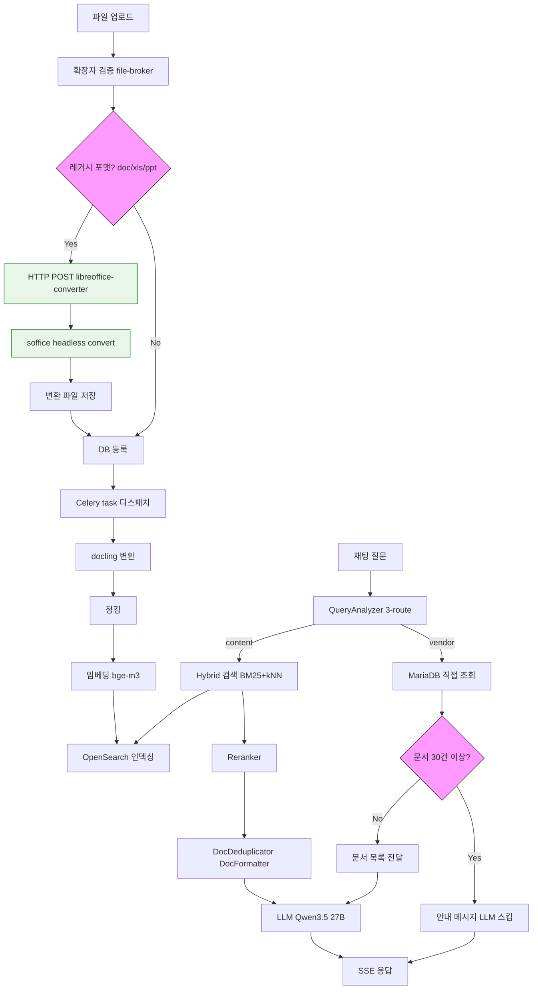

```mermaid
flowchart TD
    A["파일 업로드"] --> B["확장자 검증 file-broker"]
    B --> C{"레거시 포맷? doc/xls/ppt"}
    C -- Yes --> D["HTTP POST libreoffice-converter"]
    D --> L["soffice headless convert"]
    L --> E["변환 파일 저장"]
    E --> F["DB 등록"]
    C -- No --> F
    F --> G["Celery task 디스패치"]
    G --> H["docling 변환"]
    H --> I["청킹"]
    I --> J["임베딩 bge-m3"]
    J --> K["OpenSearch 인덱싱"]
    Q["채팅 질문"] --> N["QueryAnalyzer 3-route"]
    N -- content --> O["Hybrid 검색 BM25+kNN"]
    O --> K
    O --> P["Reranker"]
    P --> R["DocDeduplicator DocFormatter"]
    R --> S["LLM Qwen3.5 27B"]
    S --> T["SSE 응답"]
    N -- vendor --> V["MariaDB 직접 조회"]
    V --> W{"문서 30건 이상?"}
    W -- Yes --> X["안내 메시지 LLM 스킵"]
    X --> T
    W -- No --> Y["문서 목록 전달"]
    Y --> S
    style C fill:#f9f,stroke:#333
    style W fill:#f9f,stroke:#333
    style D fill:#e8f5e9,stroke:#2e7d32
    style L fill:#e8f5e9,stroke:#2e7d32

```