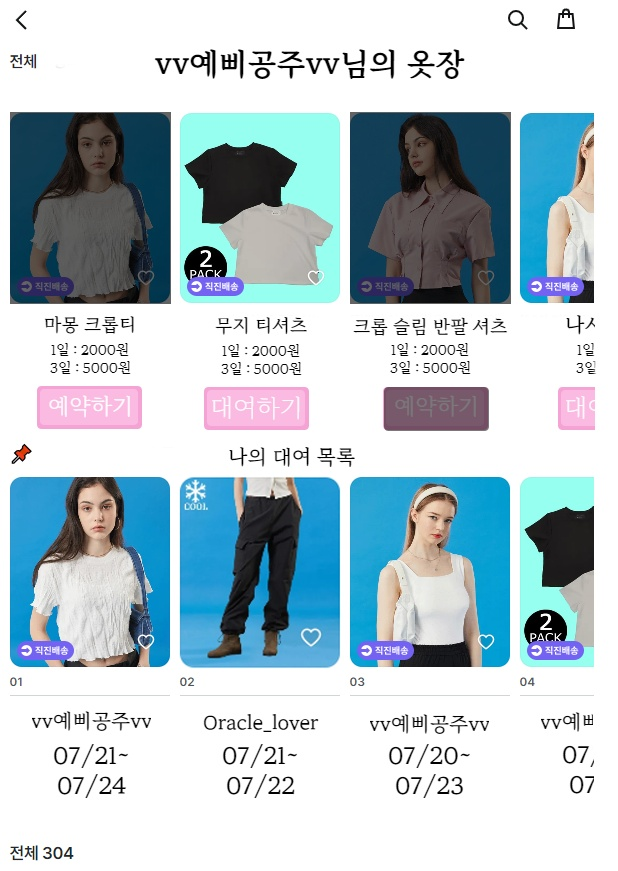
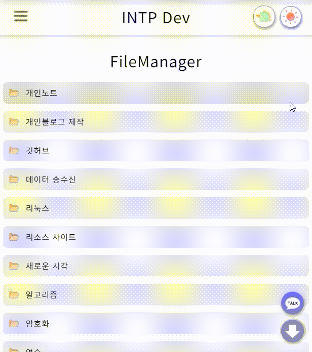
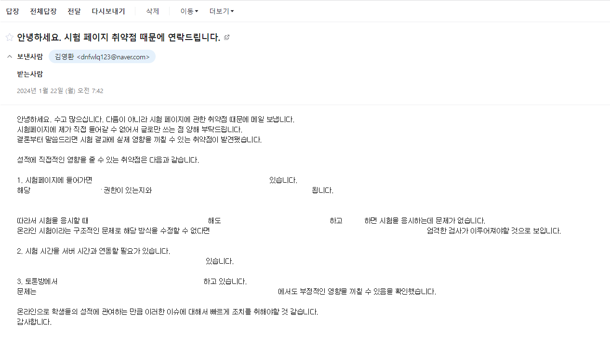

## 자기소개

* 열정을 실현하는 개발자
* 게임보다 개발을 즐기는 개발자

### 경험

저는 97년생 김영환입니다. 비전공자이며 국비지원 학원 6개월 과정을 수료하고 지난 2개월 동안 개인 프로젝트인 INTP Dev 블로그를 만드는데에 집중했습니다. 학원을 다니는 동안엔 제가 발표한 프로젝트에서 팀장을 맡게 되어 다양한 경험을 할 수 있었습니다.

#### 저는 이런게 자신있습니다.

* Stomp 프로토콜을 사용해 WebSocket 기반 실시간 채팅 구현
* AWS EC2 인스턴스 사용하여 어플리케이션 배포 및 RDS 연동
* 웹 어플리케이션을 a-z까지 스스로 마무리 지을 수 있는 끈기와 노력
* byteArray를 이용한 파일 입·출력 (사진, GIF에 워터마크 삽입 등)
* 블로그 개발을 하며 다양한 개발(프론트 엔드, 백 엔드) 경험
* 호기심과 관찰력
* 이슈와 트러블 슈팅


## 구현

### 첫 프로젝트 WearVillage


첫 프로젝트 WearVillage입니다.
제가 발표한 프로젝트가 채택되어 팀장을 맡아 진행했습니다.
WearVillage는 중고옷 대여 및 판매 플랫폼이고 당근마켓이 모티브가 되었습니다.

#### 맡은 역할

어플리케이션 개발 초기, 컨트롤러는 무엇인지, 디렉토리 구조를 어떻게 가져가야하는지에 공부하고 팀원들과 공부 내용을 공유했습니다.  
또한 팀원 중에는 정년이 다가온 어르신도 계셨고, 출석률이 낮은 팀원도 있어 실력에 격차가 생기기 시작했습니다. 이런 다양한 사람들과 프로젝트를 진행하다보니 일관된 코드 스타일을 유지하는 것이 제  1 안건이 되었습니다. 그리고 코드에 대한 이해도가 낮은 팀원을 어떻게든 같은 궤도에서 프로젝트를 진행하도록 만들어야했습니다.

#### 문제 사항

##### 협업의 문제

당시 프로젝트의 구조를 짜는데에 집중적으로 시간을 투자했습니다. 이유는 많은 인원이 기능을 맡아 구현하다보니 코드의 일관성이 많이 떨어졌고, 결과적으로 구조를 탄탄하게 짜는데 소비되는 시간보다 꼬여버린 코드를 풀어내는데 더 많은 시간이 소모되었기 때문입니다.
이러한 구조적인 문제를 해결하기 위해 camel case로 통일했고 BEM방법론을 준수해 클래스명을 지었습니다.

##### 디자인의 문제

남성 7명으로 이루어진 저희 팀은 UX/UI 역할을 맡는 것에 소극적인 모습을 보였고 저 또한 그랬습니다.
하지만 팀장으로서 눈앞에 직면한 문제를 덮어두긴 싫었고 무엇보다 완성된 프로젝트가 예쁜 그릇에 담겼으면 하는 마음이 컸습니다.

이후 저는 디자인을 맡게 되었고 스스로를 백엔드 개발자라고 단정짓던 제가 어떤식으로 UI/UX에에 접근했는지 아래에 보여드리겠습니다.

#### 문제 사항들을 해결하기 위한 노력

##### 협업


당시 작성했던 문서들입니다.

1. fetch로 요청을 보낸다.
2. 컨트롤러에서 요청을 받아 서비스로 요청을 전달한다.
3. 서비스에서 프로세스를 처리한다.
4. 컨트롤러에서 응답한다.
5. 클라이언트에서 응답 상태값에 따라 남은 프로세스를 진행한다.

이러한 프로세스를 어려워하는 팀원이 많아서 프로젝트에 가용 가능하도록 핵심 로직들을 정리했습니다.

##### 디자인

##### 카카오 오븐


##### 피그마


그림판, 포토샵, 카카오 오븐, 피그마등 다양한 툴을 시도해보았고 관련 강의 등을 실습해보며 연습했습니다.
##### 프로토타입 디자인


##### 초기 디자인


##### 중간 시점 디자인


##### 최종 디자인


**계속되는 리팩토링**


또한 위에서 언급했던 코드의 일관성 문제는 디자인에서도 나타났습니다.
이에 팀원들이 일관성있는 작업을 할 수 있도록 레이아웃을 만들어 공유했습니다.


제 아이디어를 기반으로 진행하는 프로젝트이기 때문에, 제가 생각한 내용을 팀원이 이해하기 쉽도록 의견은 항상 시각적 정보와 함께 전달하였습니다.

이 같은 노력이 완성도에 많은 관여를 했던 것 같습니다.

구조가 갖춰지고, 디자인도 제가 도맡게 되자 프로젝트 진행 속도가 빨라졌고 이후에는 저도 백엔드에 참여해 기능구현에 매진했습니다.

중고 거래 플랫폼인 만큼, 채팅 기능이 필수불가결했는데 해당 기능을 구현하기 위한 공부를 하던 중 웹소켓에 대해 알게되었습니다.

코딩과 접점이 없던 비전공자의 입장에서 웹소켓이란 기술을을 공부하게 되어 어려운 부분이 많았습니다.
그러나 실시간으로 데이터를 주고 받는다는 이점을 포기할 수 없었고 WearVillage에 웹소켓을 사용해 실시간 채팅을 구현하였습니다.
### WebSocket 기반 실시간 채팅 구현
#### 첫 웹소켓


학원에서 진행한 프로젝트 wearVillage.
옷 중고 판매 및 대여를 목적으로, 당근 마켓을 모티브로 진행했습니다.
웹소켓의 학습 곡선이 높아 어려움을 많이 겪었던 기억이 있습니다.


이처럼 실시간으로 이미지도 주고 받도록 설계하였습니다. 
해당 프로젝트에서 웹소켓 기반 실시간 채팅은 역할 분담 없이 오롯이 혼자 맡아서 했습니다.
이 경험이 INTP Dev에 채팅을 구현하는데 많은 도움이 되었습니다.

#### 두 번째 웹 소켓


이 역시 개인 프로젝트로 진행했습니다.
'Excel에 대해 소개해보세요'라는 과제를 받은 지인의 부탁으로 만들게 되었습니다.


10명 이상이 접속한 모습입니다.
기존 text  데이터만 전송하던 첫 번째 방식에서 유저의 아이디와 마우스 클릭 지점등을 객체에 담아 송수신하여 위와같이  OX게임을 구현했습니다.

제가 짠 로직이 10명 이상이 접속한 상황에서도 에러 없이 돌아가는지 확인할 수 있는 좋은 기회가 되었고, 다양한 사람들이 제가 만든 어플리케이션에서 상호작용하는 모습에 웹소켓에 큰 매력을 느껴 더 공부하는 계기가 되었습니다.
#### 세 번째 웹소켓(STOMP)


현재 블로그에 채택된 형태입니다.
기존에 간단한 Text메세지만 주고 받던 형태에서 점차 객체를 송수신하고, 나아가 STOMP 프로토콜을 사용해 payload를 EndPoint별로 처리하여 웹소켓의 유연성이 크게 증가했습니다.

#### 웹소켓 변천사


저는 세 번의 프로젝트 모두 웹소켓을 적극적으로 사용했습니다.
그 과정에서 각각의 프로젝트를 진행할 때마다 웹소켓에서 느꼈던 불편함을 피드백했고, 점차 나은 형태로 발전했습니다.

### 세 번째 프로젝트


#### INTP Dev 소개

##### 블로그 아키텍처
* Monolithic Architecture
* Layered Architecture
* STOMP (WebSocket)
* JPA
* ThymeLeaf 3.1.2
* CSS3
* HTML5
* JS (ES6)
* Java SDK 17

#### 3rd party library
* commonMark 0.20.0 (커스텀)
* Scalr 4.2
* Apache Commons3 3.13.0
* Animated Gif Encoder (Decoder)
* GeoIp2 4.2.0
* SockJS 1.1.2
* jackson 2.15.3
##### Idle
* VS Code
* IntelliJ Community Edition 2023.1.2

##### 서버
* AWS EC2 (t3.medium, storage조](image/Pasted%20image%2020240226130736.png)


#### 핵심 기능 플로우
제 블로그의 핵심 기능으로는 포스트 자동화와 채팅이 있습니다.
플로우와 함께 보시겠습니다.

##### Chat RestController

```java
@GetMapping("/chat/all")  
public ResponseEntity<Slice<ChatEntity>> getChat(Pageable pageable){  
    PageRequest request = PageRequest.of(pageable.getPageNumber(),20, Sort.by("chatId").descending());  
    try {  
        return new ResponseEntity<>(chatService.getChat(request), HttpStatus.OK);  
    } catch (Exception e){  
        return new ResponseEntity<>(HttpStatus.BAD_REQUEST);  
    }  
}
```

클라이언트로부터 받은 응답을 서비스에 전달합니다.

##### Chat Service

```java
public Slice<ChatEntity> getChat(Pageable pageable){  
    LocalDate today = LocalDate.now();  
    LocalDateTime startOfDay = today.atStartOfDay();  
    LocalDateTime startOfNextDay = today.plusDays(1).atStartOfDay();  
    return chatRepository.findAllByChatDate(startOfDay,startOfNextDay,pageable);  
}
```

현재 날짜를 기점으로 0시와 24시 사이의 채팅만을 가져오기 위해 LocalDate 타입 인자 두 개를 DAO 단에 넘깁니다.
##### Chat Repository
```java
@Query(value = "select c from ChatEntity c where  (c.chatDate >= :startOfDay) and (c.chatDate < :startOfNextDay) order by c.chatCode desc")  
Slice<ChatEntity> findAllByChatDate(@Param("startOfDay") LocalDateTime startOfDay, @Param("startOfNextDay") LocalDateTime startOfNextDay, Pageable pageable);
```

Slice 객체로 Wrapping된 ChatEntity 객체를 리턴합니다.

##### 포스트 자동화

 ###### 1.노트를 작성합니다.
 


###### 2. commonMark 라이브러리를 이용해 MarkDown To HTML을 진행합니다.


```java
@Component  
public class MarkdownCustomPath extends AbstractVisitor {  
    @Override  
    public void visit(Image image) {  
        image.setDestination("/sources/obsidian?image=" + image.getDestination());  
    }  
}
```

이미지를 파싱하기 위한 특별한 엔드포인트 요청을 보내기 위해 commonMark를 커스텀했습니다.
이제 이미지 링크가 파싱될 때는 `/sources/obsidian?image=`가 prefix에 추가됩니다.

```html
<h2>포스트를 작성합니다.</h2>
<h3>내용을 작성합니다</h3>
<p></p>
```

###### 3. 위에서 만들어진 엔드포인트에 응답하는 RestController를 작성합니다.

```java
@GetMapping("/sources/obsidian")  
public ResponseEntity<InputStreamResource> imageLoad(@RequestParam(required = false,name = "image") String path, @RequestHeader(value = "Range", required = false) String rangeHeader) throws IOException {  
    return imageLoadService.obsidianImageLoad(path,rangeHeader);  
}
```

###### 4. 서비스에서 파일 유형별로 작업합니다.

```java
File file = new File(OBSIDIAN_URL + File.separator + URLDecoder.decode(path, StandardCharsets.UTF_8)); // 기존 파일
File watermarked = new File(OBSIDIAN_URL + File.separator +  URLDecoder.decode( stringBuilder.toString(), StandardCharsets.UTF_8)); // 워터마크가 추가되어 저장될 파일
File waterMarkImage = new File(WATER_MARK_URL); // 워터마크 파일
Image waterMark = ImageIO.read(waterMarkImage); // 워터마크에서 얻은 이미지 객체

/* 이미지일 경우 */
FileInputStream fileInputStream = new FileInputStream(file);  
BufferedImage image = ImageIO.read(fileInputStream);
fileInputStream.close();  
imageUploadService.addWaterMark(image, waterMark, WaterMark.BOTTOM_RIGHT);  
FileOutputStream fileOutputStream = new FileOutputStream(watermarked);  
ImageIO.write(image, "png", fileOutputStream);

/* GIF일 경우 */
AnimatedGifEncoder gifEncoder = new AnimatedGifEncoder();  
GifDecoder gifDecoder = new GifDecoder();  
InputStream inputStream = new FileInputStream(file);  
FileOutputStream waterMarkOutput = new FileOutputStream(watermarked);  
gifDecoder.read(inputStream);  
gifEncoder.start(waterMarkOutput);  
inputStream.close();  
gifEncoder.setRepeat(0);  
gifEncoder.setFrameRate(18);  
gifEncoder.setQuality(5);  
for (int i = 0; i < gifDecoder.getFrameCount(); i++) {  
    imageUploadService.addWaterMark(gifDecoder.getFrame(i), waterMark, WaterMark.BOTTOM_RIGHT);
    gifEncoder.addFrame(gifDecoder.getFrame(i));  
}  
gifEncoder.finish();

/* 동영상일 경우 */
FileInputStream fileInputStream = new FileInputStream(file);  
long totalLength = fileInputStream.available();  
if (rangeHeader != null) {  
    long rangeStart = Long.parseLong(rangeHeader.replace("bytes=", "").split("-")[0]);  
    long rangeEnd = totalLength - 1;  
    long rangeLength = rangeEnd - rangeStart + 1;  
    headers.add("Content-Range", "bytes " + rangeStart + "-" + rangeEnd + "/" + totalLength);
    headers.setContentLength(rangeLength);  
    fileInputStream.skip(rangeStart);  
    InputStreamResource resource = new InputStreamResource(new BoundedInputStream(fileInputStream, rangeLength));  
    return new ResponseEntity<>(resource, headers, HttpStatus.PARTIAL_CONTENT);  
}  
InputStreamResource inputStreamResource = new InputStreamResource(fileInputStream);  
return new ResponseEntity<>(inputStreamResource,HttpStatus.OK);
```

특이사항으로는 워터마크 이미지를 다루기 위해 직접 설계한 WaterMark 객체를 사용하고 있고, 동영상일 경우 InputStream으로 영상을 응답했을 때 컨트롤 패널에서 시간을 조작해도 원하는 시간으로 이동되지 않아서 알아보던 와중 Range Header를 사용해 유저가 클릭할 때마다 새로운 응답을 보내 해당 장면을 재생하게 하는 것으로 해결했습니다. 위 과정에서 Apache Commons의 Bounded Stream이 사용되었습니다.

###### 5. 노트 업로드


```shell
cd obsidian && git add . && git commit -m "update" && git push
```
위의 동작을 수행하는 bat 파일을 실행해 깃에 업로드합니다.

###### 6. 노트 다운로드


깃허브에서 해당 리포지토리를 갱신하여 노트 내용을 갱신합니다.

###### 7. 포스팅

### AWS EC2 인스턴스 사용하여 어플리케이션 배포 및 RDS 연동

학원에서 진행한 프로젝트를 AWS EC2 인스턴스를 대여하여 배포했습니다.
그 과정에서 서버에 대한 이해와 리눅스 환경에 익숙해졌고, Vim이나 Putty, FileZilla등 개발에 용이한 툴의 사용법도 익혔습니다.
이렇게 공부한 내용이 INTP Dev를 개발하는데 큰 도움이 되었습니다.

### 웹 어플리케이션을 a-z까지 스스로 마무리 지을 수 있는 끈기와 노력

##### 계획


계획은 어플리케이션 개발에 방향성을 제시해줄 뿐만 아니라 하기 싫은 상황에서도 컴퓨터 앞에 앉을 수 있게 하는 강제력을 갖습니다.
계획을 세우고, 계획표 대로 일정을 소화하려고 노력한 덕분에 아르바이트를 퇴사하고 넘쳐나는 시간과 몸의 편함에 혹해 자칫 낭비할 수 있었던 2개월을 누구보다 열심히 공부할 수 있었습니다.

#### 체계적인 개발

제대로 된 구조를 갖지 못한 어플리케이션은 개발하면서 '괴롭다'는 느낌을 받습니다.
잘못짠 구조와 아무렇게나 뱉어낸 코드가 얼마나 개발을 힘들게 하는지 몸소 느꼈습니다.
첫 프로젝트인 wearVillage에서 느꼈던 불편함들을 이번 프로젝트에서 해소하고자 많은 노력을 했고, INTP Dev를 개발하는 과정에서도 구조에 한계가 느껴지면 여러번 리팩토링을 수행했습니다.
##### INTP Dev ERD


특히 데이터베이스의 구조가 바뀌는 경우, Repository나 DAO 레이어에서 많은 변경을 요구했기 때문에 데이터베이스를 설계하는데 시간을 많이 투자했습니다.

유저를 중심으로 채팅, 포스팅, 카테고리, 댓글, 답글등의 기능을 구현하기 위해 체계적으로 테이블을 작성하여 구조 변경에 의해 소모되는 불필요한 시간이 줄었고, 특히 로그 테이블은 유저들의 행동을 파악하여 블로그 기능을 개선하는데 필요하다고 느껴 신경을 많이 썼습니다.


INTP Dev를 총 세 개의 계층 구조로 나누고 각각 테이블을 할당해 유저들의 사이트 이용 정보를 파악 가능합니다. 해당 기능과 테이블은 상당히 유용하게 쓰였습니다.

또한 세가지 계층 구조는 다음과 같습니다.

* domain : 유저의 view 이동
* second : view 내에서 유저의 클릭이나 업로드 등 유저 활동
* third : view 내에서 유저의 활동과는 개별적으로 동작

태스크 플로우는 다음과 같습니다.

클라이언트
1. 유저가 main화면에서 post로 이동한다.
2. post에서 테마를 다크모드로 변경한다.
3. post에서 덧글을 작성한다.

서버
1. /domain/main => /domain/post
2. /second/theme?mode=light => /second/theme?mode=dark
3. /third/post/comment

이와 같이 계층 구조를 통해 유저로부터 원하는 정보를 뷰 단위와 행동 단위, 요청 단위로 나눠 로깅하여 원하는 정보를 손쉽게 얻도록 설계했습니다.

### byteArray를 이용한 파일 입·출력 (사진, GIF에 워터마크 삽입 등)



wearVillage 프로젝트와 현재 프로젝트를 진행하면서 이미지를 많이 다루었고, InputStream과 OutputStream에 대한 이해가 깊어지는 경험을 하였습니다. 또한 이미지가 많은 블로그 특성상 썸네일 이미지를 따로 만들지 않고 원본 이미지를 사용했을 경우 로딩 속도가 현저히 떨어지는 현상을 겪었고, 이를 해결하기 위해 이미지 파일이 저장될 때 썸네일 이미지를 동시에 저장하는 프로세스를 통해 블로그 이용 속도가 현격히 빨라지는 경험을 했습니다.

### 블로그 개발을 하며 다양한 개발(프론트 엔드, 백엔드) 경험

%201.gif)

비동기 렌더링을 통해 사용자 경험을 향상시킬 수 있습니다.
비동기 렌더링은 모바일 어플리케이션에서 아주 중요한 요소입니다. 흔히 프론트나 백엔드 중 한가지를 선호하는 경향이 강한데, 저도 비슷한 입장이지만 협업하는 과정에서 동료의 업무에 대한 이해도 필요하다고 생각합니다.

그래서 백엔드와 프론트엔드를 겸하여 평상시 공부하고 싶었던 기술인 웹소켓 등을 활용하며 다양한 경험을 할 수 있는 프로젝트를 선별했고, 이렇게 블로그를 만들게 되었습니다.


### 근거 있는 코드 작성

개발자에게 근거 있는 코드를 작성하는 능력은 아주 중요하다고 생각합니다.
저는 블로그 개발을 진행하면서 많은 이슈를 겪었고 그에 따라 이루어진 트러블슈팅에 대한 기록을 남겼습니다. 이 같은 프로세스가 제가 어떤 사고방식으로 코딩을 하는지 잘 나타내는 것 같습니다.

### 이슈와 트러블 슈팅


INTP Dev를 개발하면서 정말 많은 이슈를 겪고 많은 트러블슈팅이 이루어졌습니다.

당장에 떠오르는 것만 적어보아도 10개가 넘을 것 같습니다.
내용은 다음과 같은데, 해당 이슈들 중에서도 주요 이슈들 몇 가지를 소개하겠습니다.

* 기존 옵시디언 노트에 포함된 이미지와 동영상을 자동화하는 방법에 대한 구조적 문제(핵심)
* JPA 쿼리를 날렸을 때, 컬럼명이 소문자로 인식되지 않는 문제
* 스크롤 이벤트 최적화 문제
* 크롬 브라우저 103 이후 버전에서 CSS 오작동 문제
* EC2 storage 볼륨 문제
* 기본 첫번째 프로젝트 도메인인 wearvillage.store에서 intp-dev.co.kr로 도메인 이전 문제
* 사진만을 다루던 기존 블로그 스펙에서 GIF를 다루게 된 이후 대규모 리팩토링
* 핸드폰으로 촬영한 사진 업로드시 사진이 회전되어 업로드되는 문제
* 해외 악성 봇들에 의한 취약점 탐색 요청과 해당 봇들에 의한 리소스 낭비 문제
* GIF 렌더링 과정에서 일어난 EC2 인스턴스 메모리 문제
* MarkDown 문법을 HTML로 렌더링해주는 commonMark 라이브러리 커스텀 문제
  
#### 기존 옵시디언 노트에 포함된 이미지와 동영상을 자동화하는 방법에 대한 구조적 문제(핵심)

INTP Dev 개발 초기, 옵시디언 노트로 작성한 글을 형식을 유지한 채 블로그에 바로 포스팅하는 자동화 프로세스를  설계하고 구현을 시작했습니다.

옵시디언 노트로 작성한 내용을 블로그에서 다시 한 번 조작하는 일을 최소화하기 위해서 노트에 작성한 내용을 블로그 포스트로 이식하는 과정을 담고 있습니다.

첫 번째 과정은 원하는 동작에 맞는 맞춤형 객체를 설계하고 해당 객체를 이용한 파일 탐색 알고리즘을 만드는 것이었습니다.

##### 파일 탐색 프로세스

```java
/* 1번째 */
/* 요구되는 스펙에 따른 객체 설계 */

public class BlogFile{  
    private File file;  
    private String name;  
    private String type;  
    private long length;
}

/* 2번째 */
/* 탐색 로직 구현 */
private final List<BlogFile> blogFiles = new ArrayList<>();
public List<BlogFile> bfs(File file){  
	boolean isFile = file.isFile();
    if(isFile){  
		setBlogFileProcess(file);
    } else {  
        for (File listFile : file.listFiles()) {  
            if(ignore.contains(listFile.getName())) continue;
			setBlogFileProcess(listFile);
        }  
    }  
    return blogFiles;  
}

public void setBlogFileProcess(File file){
	String type = file.isFile() ? "file":"dir";  
	long length = type.equals("file") ? file.length() : 0L;  
	BlogFile blogFile = new BlogFile();  
	blogFile.setName(file.getName());  
	blogFile.setType(type);  
	blogFile.setFile(file);  
	blogFile.setLength(length);
	blogFiles.add(blogFile);  
}
```

메서드 명이 bfs인 이유는 Breadth First Search(너비 우선 탐색) 방식으로 접근하려다 리소스 낭비가 심할 것으로 예상되어 클릭한 폴더에 한해서만 탐색하게끔 리팩토링을 진행했습니다.


위의 프로세스를 거쳐서 노트가 작성된 폴더와 블로그 포스트간에 동기화 효과를 구현했습니다.

또한 블로그의 아이덴티티가 될만한 뭔가가 없을까 고민을 하다가 블로그를 거치는 모든 사진에 워터마크를 달면 재밌겠다는 생각이 들어 작업에 착수했습니다.


방명록과 덧글에도 워터마크가 자동 삽입됩니다.


포스팅속 이미지에서도 자동으로 워터마크가 삽입되는 프로세스를 추가했습니다.
워터마크는 사실 불펌에 대한 경고라기 보다는, 많고 많은 블로그들 중에서 차별점을 가질만한 요소가 무엇이 있을까 고민을 많이했습니다.
개인 서버를 이용한 장점을 극대화하고 싶었기 때문에 웹소켓을 이용해 채팅을 구현하고, 워터마크 이미지를 자동으로 삽입하여 블로그를 방문하는 사람들에게 특색있는 블로그라는 인상을 주고 싶었습니다.

#### 워터마크 삽입 프로세스

```java
public class WaterMark {  
    public final static WaterMark TOP_LEFT = new WaterMark("TOP_LEFT");  
    public final static WaterMark BOTTOM_LEFT = new WaterMark("BOTTOM_LEFT");  
    public final static WaterMark TOP_RIGHT = new WaterMark("TOP_RIGHT");  
    public final static WaterMark BOTTOM_RIGHT = new WaterMark("BOTTOM_RIGHT");  
    public final static int WATERMARK_WHITE_SPACE = 25;  
    private final String position;  
    
    public WaterMark(String str){  
        this.position = str;  
    }  
  
    public String getPosition(){  
        return this.position;  
    }  
    
    public void addWaterMark(Image originalImage, Image waterMarkImage, WaterMark waterMark) throws ImageWriteException {  
    // null은 옵저버 사용하지 않겠다는 의미
    // 프로세스의 중간 과정이 아닌, 렌더링이 끝난 정보에 접근함
    int originalWidth = originalImage.getWidth(null);  
    int 즈  
    int pointSize = Math.min(originalWidth, originalHeight)/12;
    // 이미지가 아무리 작아도 워터마크의 최소 크기를 50픽셀로 제한함  
    int smallImageProcess = Math.max(pointSize,50);  
    Image scaledWaterMark = waterMarkImage.getScaledInstance(smallImageProcess,smallImageProcess,Image.SCALE_SMOOTH);  
    int waterMarkWidth = scaledWaterMark.getWidth(null);  
    int waterMarkHeight = scaledWaterMark.getHeight(null);  

	// 워터마크 크기 + WATERMARK_WHITE_SPACE 크기보다 사진이 작을 경우 워터마크를 삽입하지 않음
    if(waterMarkWidth + WaterMark.WATERMARK_WHITE_SPACE >= originalWidth  
            || waterMarkHeight + WaterMark.WATERMARK_WHITE_SPACE >= originalHeight){  
        return;  
    }  
    int drawX = 0;  
    int drawY = 0;
    
    /*  
    * 워터마크의 포지션을 인자로 받는다.  
    * 각각의 포지션에서 WATERMARK_WHITE_SPACE만큼의 여유공간을 가진다.  
    * */    switch (waterMark.getPosition()){  
        case "TOP_LEFT" ->  {
	        drawX = WaterMark.WATERMARK_WHITE_SPACE;  
            drawY = WaterMark.WATERMARK_WHITE_SPACE;
            }  
        case "BOTTOM_LEFT" -> {
	        drawX = WaterMark.WATERMARK_WHITE_SPACE;  
            drawY = originalHeight - waterMarkHeight - WaterMark.WATERMARK_WHITE_SPACE;
            }  
        case "TOP_RIGHT" -> {
	        drawX = originalWidth - waterMarkWidth - WaterMark.WATERMARK_WHITE_SPACE;  
            drawY = WaterMark.WATERMARK_WHITE_SPACE;
            }  
        case "BOTTOM_RIGHT" -> {
	        drawX = originalWidth - waterMarkWidth - WaterMark.WATERMARK_WHITE_SPACE;  
	        drawY = originalHeight - waterMarkHeight - WaterMark.WATERMARK_WHITE_SPACE;}  
		    }  
    Graphics graphics = originalImage.getGraphics();  
    graphics.drawImage(scaledWaterMark,drawX,drawY,null);  
    graphics.dispose();   
		}
	}
```

#### 새로운 포스트 작성


옵시디언 노트를 사용하지 않는 경우에도 포스트를 작성할 수 있게끔 간단한 에디터도 구현했습니다.
또한 사진이나 썸네일은 원하는 이미지가 업로드되었는지 바로바로 체크할 수 있고, 불필요한 리소스 낭비를 줄이기 위해 createURLObject를 사용해 Blob에 대한 임시 참조 URL을 생성해 서버의 프로세스와 관련 없이 업로드한 이미지를 바로 표시해줍니다.
업로드 버튼을 누르면 비로소 실제 URL로 대체되어 표시됩니다.
#### 해외 악성 봇들에 의한 취약점 탐색 요청과 해당 봇들에 의한 리소스 낭비 문제


서버에 블로그를 배포하고 며칠이 지나자 하루에 요청이 5천개 가까이 왔는데, 사이트를 돌아다니는 봇들이 서버의 취약점을 검사하는 듯한 요청이 많이 보였고 실제로 위 요청은 WordPress 취약점을 악용하는 요청인 것으로 확인되었습니다.


대부분의 주소들이 해외 아이피이고, 제 블로그 특성상 해외 아이피의 유입은 불필요하다는 생각이 들었습니다.
따라서 GeoLocation의 무료 데이터베이스를 다운 받아 Filter를 적용했고, 데이터베이스 내 유저 Iso 코드가 KR이 아닐 경우 차단하여 매크로 봇에 의한 리소스 낭비를 없앴습니다. GoogleBot(구글 Agent)과 Yeti (네이버 Agent)는 예외로 두었습니다.

#### 스크롤 이벤트 최적화 문제

스크롤을 사용하던 중 디버거를 확인한 결과 scroll 이벤트가 과하게 많이 발생한다는 생각이 들었고, 해당 이벤트를 최적화하기 위한 방법을 고민했습니다.


그 결과 Throttling 기법을 사용해 최적화를 진행했고 30ms라는 비교적 짧은 Interval를 설정해주는 것만으로도 90%에 가까운 최적화가 이루어졌습니다.
INTP Dev의 경우 scroll 이벤트를 통한 실시간 렌더링이 중요하여 5ms로 Interval를 설정했음에도 요청 횟수가 50% 이상 감소되었습니다.

```js
/*
최초 실행한 이후 대기 상태에 돌입합니다.
설정한 limit 시간이 경과될 경우 다시 활동 상태에 접어듭니다.
이를 통해 이벤트 사이의 interval를 조정함으로써 스크롤 이벤트를 최적화합니다.
*/
function throttling(method, limit){  
    let wait = false;  
    return function (){  
        if(!wait){  
            method();  
            wait = true;  
            setTimeout(()=>{  
                wait = false;  
            },limit)  
        }  
    }
```

#### 크롬 브라우저 103 이후 버전에서 CSS 오작동 문제

해당 문제가 상당히 까다롭게 작용했습니다.
이유는 다양한 테스트 환경을 갖추지 못한 개발 환경에서 개발하다보니, 진행이 상당히 된 시점에서 구버전 브라우저를 쓰는 피씨방 컴퓨터로 접속을 했다가 해당 문제를 파악하게 되었습니다.

```css
/* 구 버전에서 동작 안 함 */
.some{
	@media (max-width: 767px){
		color:white;
	}
}

/* 구 버전에서 동작 함 */
@media (max-width: 767px){
	.some{
		color:white;
	}
}
```

미디어 쿼리 별로 작성했던 CSS가 최신 브라우저에서만 지원하는 형태였습니다.
따라서 모든 코드를 리팩토링했고 이후 CanIUse를 통해 지원 여부를 파악하는 습관을 들이게 됐습니다.

#### 핸드폰으로 촬영한 사진 업로드시 사진이 회전되어 업로드되는 문제

이는 사진의 메타 정보에 있는 orientation 값을 처리하는 과정에 생긴 문제로, orientation이 1이라면 그대로 업로드를 진행했고, 그 외의 값이라면 해당 값에 따라 이미지를 회전처리했습니다.
외부 라이브러리 Scalr를 사용했습니다.

#### MarkDown 문법을 HTML로 렌더링해주는 commonMark 라이브러리 커스텀 문제

옵시디언 노트로 작성한 내용을 블로그에 올리기 위해 commonMark 라이브러리의 MarkDownParser를 사용하는데, 이때 해당 라이브러리가 video 태그를 지원하지 않아 커스텀이 필요했습니다.

제 요구사항은 다음과 같았습니다.

1. 옵시디언 노트에 링크된 파일이 이미지일 경우 ``  형태로 태그를 생성하되, `` 형태로 생성되며, ``태그와 달리 `<video></video>` 닫히는 태그로 동작해야함

위 동작을 하기 위해 commonMark 라이브러리를 뜯어볼 시간이 필요했고, 2 ~ 3일 동안 집중적으로 탐구하여 해결책을 찾은 뒤, 제작자의 github에서 라이브러리를 다운받아 해당 코드를 수정하고 jar로 재배포해 INTP Dev 라이브러리에 추가해서 사용했습니다.

```java
@Override  
public void visit(Image image) {  
    image.setDestination("/sources/obsidian?image=" + image.getDestination());  
}
```

이미지의 경우 라이브러리에서 제공하는 확장 메서드를 사용해서 `/sources/obsidian?image=` prefix 처리를 자동화하였습니다.

```java
/* 수정 전 */
@Override  
public void visit(Image image) {  
    String url = image.getDestination();  
    AltTextVisitor altTextVisitor = new AltTextVisitor();  
    image.accept(altTextVisitor);  
    String altText = altTextVisitor.getAltText();  
    Map<String, String> attrs = new LinkedHashMap<>();  
    if (context.shouldSanitizeUrls()) {  
        url = context.urlSanitizer().sanitizeImageUrl(url);  
    }  
    Iterator var8 = videoExtension.iterator();
    String src = context.encodeUrl(url);  
    attrs.put("src", src);  
    attrs.put("alt", altText);  
    if (image.getTitle() != null) {  
        attrs.put("title", image.getTitle());  
    }  
    html.tag("img", getAttrs(image, "img", attrs), true);  
}


/* 수정 후 */
public void visit(Image image) {  
    // ... 생략
	if(src.substring(src.lastIndexOf(".") + 1).equals(extension)){
		attrs.put("width", "100%");  
	    this.html.tag("video controls", this.getAttrs(image, "video", attrs));  
	    this.html.tag("/video");  
	    return;
	}
    html.tag("img", getAttrs(image, "img", attrs), true);  
}
```

동영상일 경우 extension이라는 변수에 담긴 각종 확장자들 (mov,avi,mp4,wmv)에 해당할 경우 video 태그를 반환하도록 커스텀했습니다.

### 호기심과 관찰력

저는 문제가 발생하거나 호기심을 자극할만한 요소가 있으면 집요하게 해당 문제를 파고듭니다.
또한 사이트나 어플리케이션, 프로그램을 이용하면서도 어떤 로직에 의해 동작하는 것인지 항상 궁금했고,
마찬가지로 모 사이트에서 시험을 치루던 중 '이런 사이트의 보안은 얼마나 철저할까'라는 호기심에 이것저것 탐구하다가 치명적인 취약점을 찾아내게 됩니다.



해당  홈페이지는 대한민국 대학생이라면 한 번쯤 시험을 치뤄본 사이트입니다.
제가 메일을 두 번이나 보냈음에도 불구하고 답변 메일이 없어 후속 조치가 이루어졌는지 몰라 자세한 내용은 적을 수 없습니다.
해당 취약점을 이용하면 F등급을 받아야하는 학생이 A+를 받는 것이 확정적으로 가능합니다.

### 각오 한마디

팀프로젝트와 개인 프로젝트를 모두 겪어보면서 각각의 고충에 대해 알게되었습니다.
또한 INTP Dev라는 웹 어플리케이션의 생명주기를 처음부터 끝까지 경험해보면서 CSS, HTML, JAVA, SpringBoot, Oracle등 다방면으로 일어나는 문제에 대응하면서 많은 실력 향상을 겪었습니다.
또한 2개월 동안 많은 어려움을 겪으면서도 코딩을 즐기는 자신을 보고 적성에 맞다는 확신이 듭니다.
맡겨진 업무에 최선을 다하겠습니다. 감사합니다.


